# Protoflow

[](https://unlicense.org)
[](https://rust-lang.org)
[](https://crates.io/crates/protoflow)
[](https://docs.rs/protoflow/latest/protoflow/)

_"Τὰ πάντα ῥεῖ καὶ οὐδὲν μένει" — Heraclitus_

**Protoflow** is a [Rust] implementation of [flow-based programming] (FBP),
with messages encoded as [Protocol Buffers]. It can be used to implement
dataflow systems consisting of interconnected blocks that process messages.

🚧 _We are building in public. This is presently under heavy construction._

## ✨ Features

- Implements a flow-based programming (FBP) dataflow scheduler.
- Constructs systems by connecting reusable components called blocks.
- Uses Protocol Buffers messages for inter-block communication.
- Currently offers a threaded runtime with an in-process transport.
- Planned support for pluggable runtimes (threaded, async, etc).
- Planned support for pluggable transports (in-process, socket, etc).
- Includes a command-line interface (CLI) for executing Protoflow blocks.
- Supports opting out of any feature using comprehensive feature flags.
- Adheres to the Rust API Guidelines in its [naming conventions].
- 100% free and unencumbered public domain software.

## 🛠️ Prerequisites

- [Rust](https://rust-lang.org) 1.70+

## ⬇️ Installation

### Installation via Homebrew

```bash
brew tap AsimovPlatform/tap
brew install protoflow --HEAD
```

### Installation via Cargo

```bash
cargo install protoflow
```

## 👉 Examples

### Examples for Rust

For Rust examples, see the [`examples`] directory. Good places to start are
the [`echo_lines`] and [`count_lines`] examples:

```bash
cargo run --example echo_lines < CHANGES.md
cargo run --example count_lines < README.md
```

#### The [`count_lines`] example

```rust filename="lib/protoflow/examples/count_lines/main.rs"
use protoflow::{blocks::*, BlockResult};

pub fn main() -> BlockResult {
    System::run(|s| {
        let stdin = s.read_stdin();

        let line_decoder = s.decode_lines();
        s.connect(&stdin.output, &line_decoder.input);

        let counter = s.count::<String>();
        s.connect(&line_decoder.output, &counter.input);

        let count_encoder = s.encode_lines();
        s.connect(&counter.count, &count_encoder.input);

        let stdout = s.write_stdout();
        s.connect(&count_encoder.output, &stdout.input);
    })
}
```

## 📚 Reference

### Glossary

- **System**: A collection of blocks that are connected together.
  Systems are the top-level entities in a Protoflow program.

- **Block**: An encapsulated system component that processes messages.
  Blocks are the autonomous units of computation in a system.

- **Port**: A named connection point on a block that sends or receives
  messages. Ports are the only interfaces through which blocks communicate
  with each other.

- **Message**: A unit of data that flows between blocks in a system.
  Messages are Protocol Buffers packets that are processed by blocks.

### Blocks

The built-in blocks provided by Protoflow are listed below:

| Block             | Description                                                                                              |
|:------------------|:---------------------------------------------------------------------------------------------------------|
| [`Buffer`]        | Stores all messages it receives.                                                                         |
| [`Const`]         | Sends a constant value.                                                                                  |
| [`Count`]         | Counts the number of messages it receives, while optionally passing them through.                        |
| [`Decode`]        | Decodes messages from a byte stream.                                                                     |
| [`DecodeJSON`]    | Decodes JSON messages from a byte stream.                                                                |
| [`Delay`]         | Passes messages through while delaying them by a fixed or random duration.                               |
| [`Drop`]          | Discards all messages it receives.                                                                       |
| [`Encode`]        | Encodes messages to a byte stream.                                                                       |
| [`EncodeHex`]     | Encodes a byte stream into hexadecimal form.                                                             |
| [`EncodeJSON`]    | Encodes messages into JSON format.                                                                       |
| [`Hash`]          | Computes the cryptographic hash of a byte stream.                                                        |
| [`Random`]        | Generates and sends a random value.                                                                      |
| [`ReadDir`]       | Reads file names from a file system directory.                                                           |
| [`ReadEnv`]       | Reads the value of an environment variable.                                                              |
| [`ReadFile`]      | Reads bytes from the contents of a file.                                                                 |
| [`ReadStdin`]     | Reads bytes from standard input (aka stdin).                                                             |
| [`WriteFile`]     | Writes or appends bytes to the contents of a file.                                                       |
| [`WriteStderr`]   | Writes bytes to standard error (aka stderr).                                                             |
| [`WriteStdout`]   | Writes bytes to standard output (aka stdout).                                                            |
| [`ConcatStrings`] | Concatenates the received string messages, with an optional joiner string inserted between each message. |
| [`SplitString`]   | Splits the received input message, with an optional delimiter string parameter.                          |
| [`DecodeCsv`]     | Decodes the received input bytes message.                                                                |

#### [`Buffer`]

A block that simply stores all messages it receives.

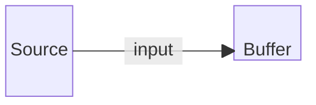

```bash
protoflow execute Buffer
```

#### [`Const`]

A block for sending a constant value.

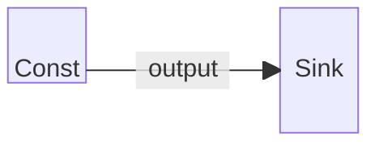

```bash
protoflow execute Const value=Hello
```

#### [`Count`]

A block that counts the number of messages it receives, while optionally passing them through.

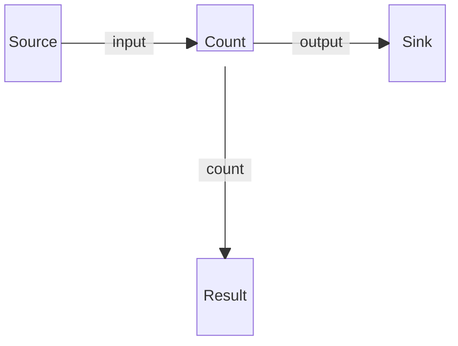

```bash
protoflow execute Count
```

#### [`Decode`]

A block that decodes `T` messages from a byte stream.

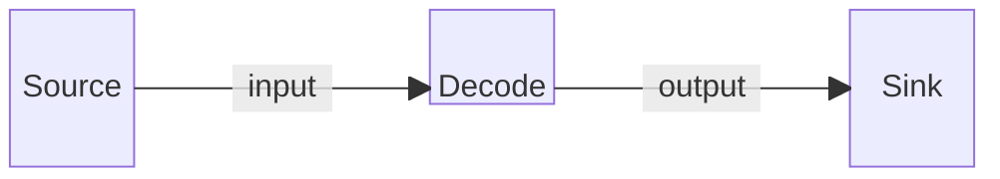

```bash
protoflow execute Decode encoding=text
```

#### [`DecodeJSON`]

A block that decodes JSON messages from a byte stream.

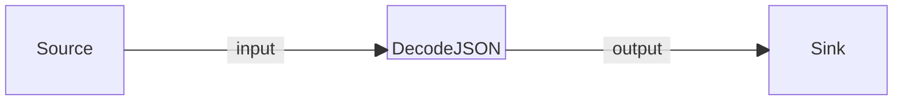

```bash
protoflow execute DecodeJSON
```

#### [`Delay`]

A block that passes messages through while delaying them by a fixed or random duration.

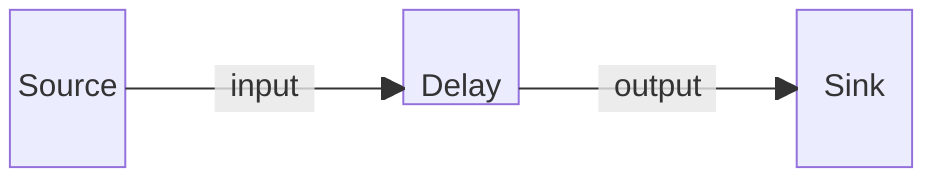

```bash
protoflow execute Delay fixed=2
```

#### [`Drop`]

A block that simply discards all messages it receives.

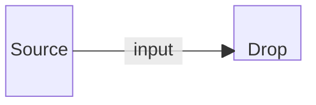

```bash
protoflow execute Drop
```

#### [`Encode`]

A block that encodes `T` messages to a byte stream.

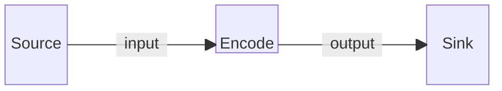

```bash
protoflow execute Encode encoding=text
protoflow execute Encode encoding=protobuf
```

#### [`EncodeHex`]

A block that encodes a byte stream into hexadecimal form.

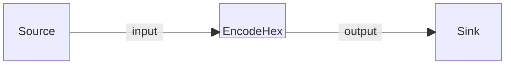

```bash
protoflow execute EncodeHex
```

#### [`EncodeJSON`]

A block that encodes messages into JSON format.

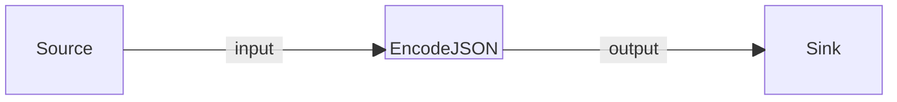

```bash
protoflow execute EncodeJSON
```

#### [`Hash`]

A block that computes the cryptographic hash of a byte stream, while optionally
passing it through.


```bash
protoflow execute Hash algorithm=blake3
```

#### [`Random`]

A block for generating and sending a random value.

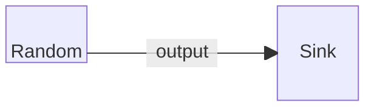

```bash
protoflow execute Random seed=42
```

#### [`ReadDir`]

A block that reads file names from a file system directory.


```bash
protoflow execute ReadDir path=/tmp
```

#### [`ReadEnv`]

A block that reads the value of an environment variable.

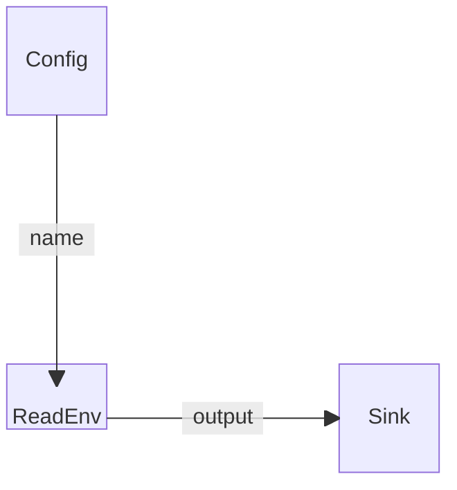

```bash
protoflow execute ReadEnv name=TERM
```

#### [`ReadFile`]

A block that reads bytes from the contents of a file.

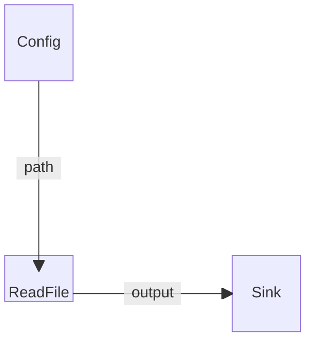

```bash
protoflow execute ReadFile path=/tmp/file.txt
```

#### [`ReadStdin`]

A block that reads bytes from standard input (aka stdin).

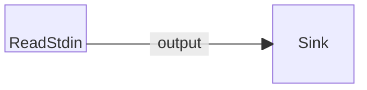

```bash
protoflow execute ReadStdin < input.txt
```

#### [`WriteFile`]

A block that writes or appends bytes to the contents of a file.

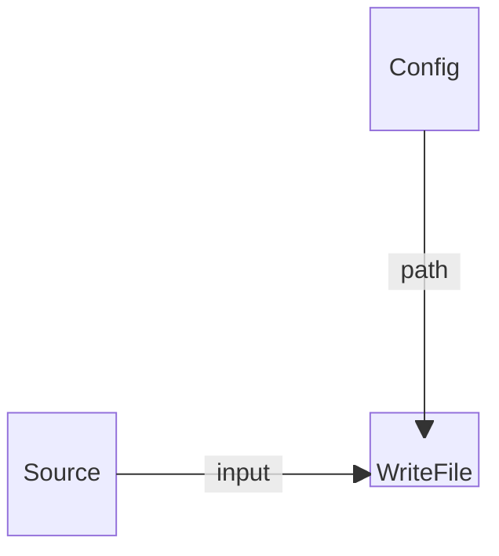

```bash
protoflow execute WriteFile path=/tmp/file.txt
```

#### [`WriteStderr`]

A block that writes bytes to standard error (aka stderr).


```bash
protoflow execute WriteStderr < input.txt 2> output.txt
```

#### [`WriteStdout`]

A block that writes bytes to standard output (aka stdout).


```bash
protoflow execute WriteStdout < input.txt > output.txt
```

#### [`ConcatStrings`]

A block for concatenating all string messages it receives

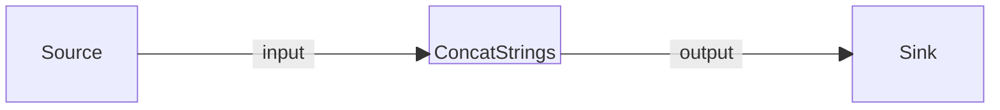

```bash
protoflow execute ConcatStrings joiner=","
```

#### [`SplitString`]

A block that splits string

```mermaid
block-beta
    columns 7
    Source space:2 SplitString space:2 Sink
    Source-- "input" -->SplitString
    SplitString-- "output" -->Sink

    classDef block height:48px,padding:8px;
    classDef hidden visibility:none;
    class SplitString block
    class Source hidden
    class Sink hidden
```

```bash
protoflow execute SplitString delimiter=","
```

#### [`DecodeCsv`]

A block that decodes csv file

```mermaid
block-beta
    columns 7
    Source space:2 DecodeCsv space:2 Sink
    Source-- "input" -->DecodeCsv
    DecodeCsv-- "header" -->Sink

    classDef block height:48px,padding:8px;
    classDef hidden visibility:none;
    class DecodeCsv block
    class Source hidden
    class Sink hidden
```

```bash
protoflow execute DecodeCsv path="your-file.csv"
```

## 👨‍💻 Development

```bash
git clone https://github.com/AsimovPlatform/protoflow.git
```

- - -

[](https://twitter.com/share?url=https://github.com/AsimovPlatform/protoflow&text=Protoflow)
[](https://reddit.com/submit?url=https://github.com/AsimovPlatform/protoflow&title=Protoflow)
[](https://news.ycombinator.com/submitlink?u=https://github.com/AsimovPlatform/protoflow&t=Protoflow)
[](https://www.facebook.com/sharer/sharer.php?u=https://github.com/AsimovPlatform/protoflow)

[Protocol Buffers]: https://protobuf.dev
[Rust]: https://rust-lang.org
[flow-based programming]: https://jpaulm.github.io/fbp/
[naming conventions]: https://rust-lang.github.io/api-guidelines/naming.html

[`count_lines`]: lib/protoflow/examples/count_lines
[`echo_lines`]: lib/protoflow/examples/echo_lines
[`examples`]: lib/protoflow/examples

[`Buffer`]: https://docs.rs/protoflow-blocks/latest/protoflow_blocks/struct.Buffer.html
[`Const`]: https://docs.rs/protoflow-blocks/latest/protoflow_blocks/struct.Const.html
[`Count`]: https://docs.rs/protoflow-blocks/latest/protoflow_blocks/struct.Count.html
[`Decode`]: https://docs.rs/protoflow-blocks/latest/protoflow_blocks/struct.Decode.html
[`DecodeJSON`]: https://docs.rs/protoflow-blocks/latest/protoflow_blocks/struct.DecodeJson.html
[`Delay`]: https://docs.rs/protoflow-blocks/latest/protoflow_blocks/struct.Delay.html
[`Drop`]: https://docs.rs/protoflow-blocks/latest/protoflow_blocks/struct.Drop.html
[`Encode`]: https://docs.rs/protoflow-blocks/latest/protoflow_blocks/struct.Encode.html
[`EncodeHex`]: https://docs.rs/protoflow-blocks/latest/protoflow_blocks/struct.EncodeHex.html
[`EncodeJSON`]: https://docs.rs/protoflow-blocks/latest/protoflow_blocks/struct.EncodeJson.html
[`Hash`]: https://docs.rs/protoflow-blocks/latest/protoflow_blocks/struct.Hash.html
[`Random`]: https://docs.rs/protoflow-blocks/latest/protoflow_blocks/struct.Random.html
[`ReadDir`]: https://docs.rs/protoflow-blocks/latest/protoflow_blocks/struct.ReadDir.html
[`ReadEnv`]: https://docs.rs/protoflow-blocks/latest/protoflow_blocks/struct.ReadEnv.html
[`ReadFile`]: https://docs.rs/protoflow-blocks/latest/protoflow_blocks/struct.ReadFile.html
[`ReadStdin`]: https://docs.rs/protoflow-blocks/latest/protoflow_blocks/struct.ReadStdin.html
[`WriteFile`]: https://docs.rs/protoflow-blocks/latest/protoflow_blocks/struct.WriteFile.html
[`WriteStderr`]: https://docs.rs/protoflow-blocks/latest/protoflow_blocks/struct.WriteStderr.html
[`WriteStdout`]: https://docs.rs/protoflow-blocks/latest/protoflow_blocks/struct.WriteStdout.html
[`ConcatStrings`]: https://docs.rs/protoflow-blocks/latest/protoflow_blocks/struct.ConcatStrings.html
[`SplitString`]: https://docs.rs/protoflow-blocks/latest/protoflow_blocks/struct.SplitString.html
[`DecodeCsv`]: https://docs.rs/protoflow-blocks/latest/protoflow_blocks/struct.DecodeCsv.html
