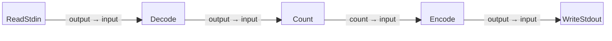

# Count Lines Example

This is a simple five-block example program that reads bytes from standard
input (stdin), decodes them into strings of newline-terminated lines, keeps a
line count of the number of lines read, and after reading all input lines writes
out that line count on standard output (stdout).

Note that unlike the trivial [`echo_lines`](../echo_lines) example program,
this program is not contingent on the terminal itself being line buffered.

## Block Diagram

