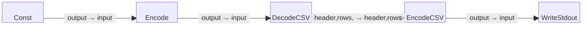

# CSV Processing Example

This is a simple five-block example program that starts with a constant string
containing CSV data, encodes it into a byte stream, decodes it back into
structured CSV data consisting of headers and rows, re-encodes that structured
data back into CSV format, and writes the result to standard output (stdout).

Note that this program ensures the integrity of the CSV data during the decoding
and re-encoding process and demonstrates the handling of structured data in CSV format.

## Block Diagram

