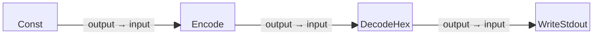

# Hex Decode Example

This is a simple four-block example program that starts with a constant string
containing hexadecimal-encoded data, encodes it into a byte stream,
decodes the hexadecimal back into raw bytes, and writes the decoded data to
standard output (stdout).

Note that this program demonstrates how to handle hexadecimal input without
relying on external files or sources, making it fully self-contained.

## Block Diagram

