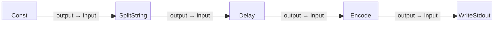

# Delayed Line Output Example

This is a simple five-block example program that starts with a constant string
containing multiple lines, splits the string into individual lines,
introduces a delay between processing each line, and writes the delayed lines
to standard output (stdout).

Note that this program demonstrates how to control the timing of data processing,
making it suitable for simulating real-time output or throttling data streams

## Block Diagram

