# Echo Lines Example

This is a trivial example program that reads bytes from standard input (stdin)
and writes them to standard output (stdout). Since stdin and stdout are line
buffered in the terminal, this effectively ends up echoing lines of text.

## Block Diagram

```mermaid
block-beta
    columns 4
    ReadStdin space:2 WriteStderr
    ReadStdin-- "output → input" -->WriteStderr

    classDef block height:48px,padding:8px;
    classDef hidden visibility:none;
    class ReadStdin block
    class WriteStderr block
```

