# Echo Lines Example

This is a trivial two-block example program that reads bytes from standard
input (stdin) and writes them to standard output (stdout).

Since stdin and stdout are line buffered in the terminal, effectively this
program ends up echoing lines of text without needing to decode/encode lines.

## Block Diagram

```mermaid
block-beta
    columns 4
    ReadStdin space:2 WriteStdout
    ReadStdin-- "output → input" -->WriteStdout

    classDef block height:48px,padding:8px;
    classDef hidden visibility:none;
    class ReadStdin block
    class WriteStdout block
```

