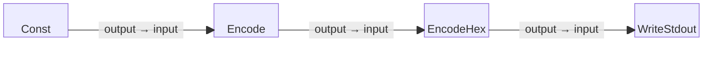

# Hex Encode Example

This is a simple four-block example program that starts with a constant string,
encodes it into a byte stream, converts the bytes into hexadecimal format,
and writes the hexadecimal-encoded output to standard output (stdout).

Note that this program demonstrates how to transform human-readable text into
its hexadecimal representation, which can be useful for encoding data for secure
transmission or storage.

## Block Diagram

