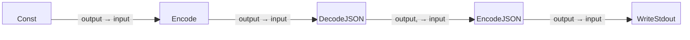

# JSON Processing Example

This is a simple five-block example program that starts with a constant string
containing JSON data, encodes it into a byte stream, decodes it back into
structured JSON data, re-encodes that structured data into JSON format,
and writes the re-encoded JSON data to standard output (stdout).

Note that this program demonstrates the complete processing cycle of JSON data,
ensuring that the data is parsed and re-encoded while preserving its original
structure.

## Block Diagram

