# Environment Variable Processor Example

This is a simple five-block example program that starts by reading the PATH
environment variable, splits its value into individual components based on
the : delimiter, transforms the components into a newline-separated list,
and writes the resulting list to standard output (stdout).

Note that this program demonstrates how to process and format environment
variable values, making it suitable for scenarios where structured output
of environment variables is required.

## Block Diagram

```mermaid
block-beta
    columns 16
    Const space:2 ReadEnv space:2 SplitString space:2 ConcatStrings space:2 Encode space:2 WriteStdout
    Const-- "output → name" -->ReadEnv
    ReadEnv-- "output → input" -->SplitString
    SplitString-- "output, → input" -->ConcatStrings
    ConcatStrings-- "output → input" -->Encode
    Encode-- "output → input" -->WriteStdout

    classDef block height:48px,padding:8px;
    classDef hidden visibility:none;
    class Const block
    class ReadEnv block
    class SplitString block
    class ConcatStrings block
    class Encode block
    class WriteStdout block
```

