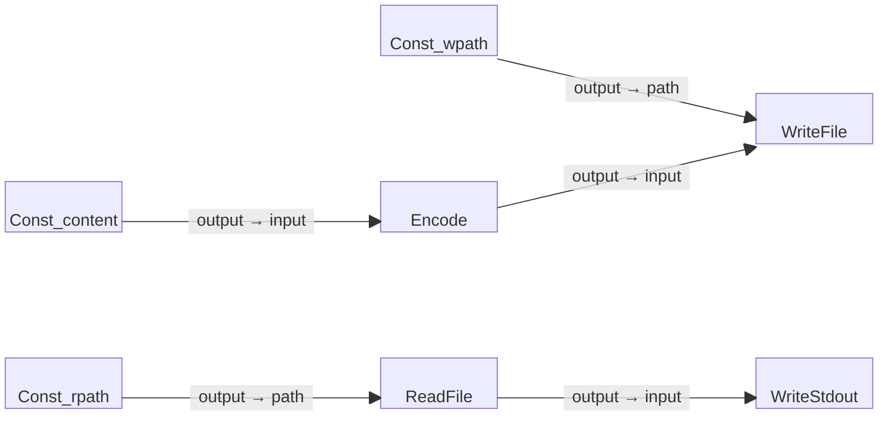

# Read File Example

This is a simple seven-block example program that begins with a constant string
containing multiple lines of text, writes the content to a file, reads the file
back into the system, and writes the file's content to standard output (stdout).

Note that this program is fully self-contained, creating and processing the file
entirely within the flow, making it suitable for demonstrating file handling
in a standalone scenario.

## Block Diagram

