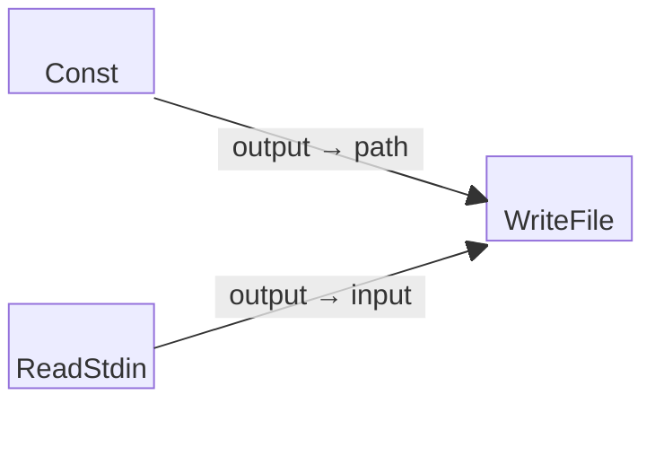

# Write File Example

This is a simple three-block example program that reads input from standard input
(stdin) and writes the content directly to a file (`output.txt`).

Note that this program demonstrates how to capture user input or piped data
and store it persistently in a file.

## Block Diagram

